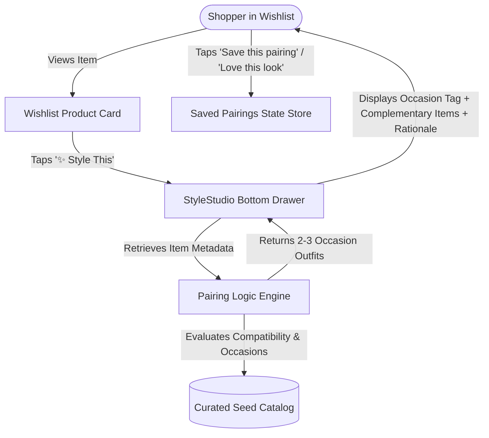
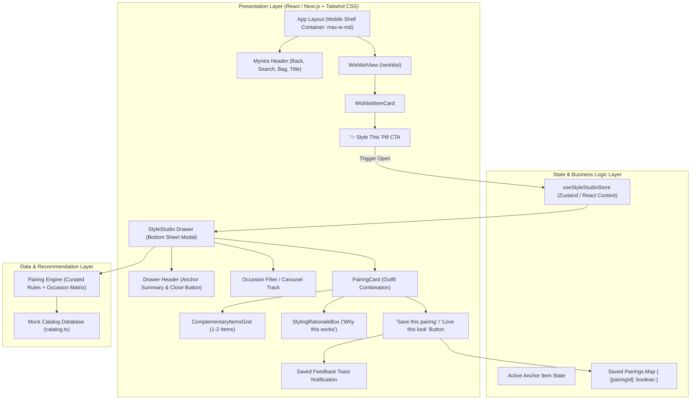
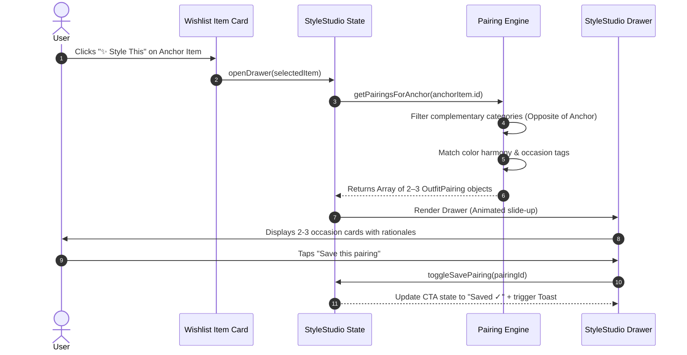

# System Architecture & Technical Specification — Myntra "StyleStudio"

## 1. Executive Summary & Objective

**StyleStudio** is a high-intent styling drawer embedded directly into the Myntra Wishlist experience (`/wishlist`). Its core purpose is to solve the **"Rule of 3"** hesitation barrier: high-conviction shoppers (`GENUINE_PURCHASE_INTENT`) stall on purchasing wishlisted items because they struggle to visualize at least 3 distinct, real-world outfit combinations.

StyleStudio provides instant, occasion-tagged outfit pairings and contextual styling rationales directly in-flow, eliminating the need for users to abandon the app for external moodboards (Pinterest, Canva, WhatsApp polls).



---

## 2. Core Design Principles & Scope Discipline

1. **In-Flow Deliberation (Zero Context Switching):** StyleStudio opens as an interactive bottom drawer/sheet over the wishlist view without triggering full-page navigation or disruptive route changes.
2. **Occasion-Centric Resolution:** Every outfit pairing is tied to a concrete real-world context (`Office`, `Weekend Casual`, `Evening Out`, `Brunch / Smart Daywear`) to systematically validate the "Rule of 3".
3. **Transparent Styling Framing:** Pairings are communicated clearly as *"Curated Styling Suggestions"* to maintain trust and credibility.
4. **Zero-Monetary & Zero-Pressure Policy:**
   - No pricing, discount badges, slash pricing, or checkout/cart-bundling mechanics are rendered anywhere.
   - The primary interaction is lightweight affirmation (**"Love this look"** / **"Save this pairing"**).
5. **Strict Non-Goals Enforcement:**
   - ❌ No comparison matrices or side-by-side spec comparisons
   - ❌ No fit/height/UGC video filtering tools
   - ❌ No social/WhatsApp polling tools
   - ❌ No backend user authentication or live catalog scraping

---

## 3. System Architecture & Component Hierarchy



---

## 4. Data Models & TypeScript Contracts

```typescript
// 1. Occasion Taxonomies for the Rule of 3
export type OccasionType = 
  | 'Office / Workwear'
  | 'Weekend Casual'
  | 'Evening Out'
  | 'Brunch / Smart Daywear';

// 2. Garment Categories
export type ProductCategory = 
  | 'Topwear'
  | 'Bottomwear'
  | 'Footwear'
  | 'Outerwear / Layer'
  | 'Accessories';

// 3. Catalog Item Entity
export interface CatalogItem {
  id: string;
  brand: string;
  name: string;
  category: ProductCategory;
  subCategory: string; // e.g., 'Linen Blazer', 'Tailored Trousers', 'Loafers'
  color: string;
  imageUrl: string;
  imageAlt: string;
  tags: string[];
}

// 4. Wishlist Anchor Item (Specialized Catalog Item in User Wishlist)
export interface WishlistItem extends CatalogItem {
  isAnchor: boolean;
  addedAt: string;
  stylable: boolean;
}

// 5. Outfit Pairing Unit (Resolves 1 Occasion)
export interface OutfitPairing {
  id: string;
  anchorItemId: string;
  occasion: OccasionType;
  title: string; // e.g., "Sharp Workwear Edit"
  complementaryItems: CatalogItem[]; // 1–2 items (e.g. Bottomwear + Footwear)
  stylingRationale: string; // Actionable styling logic (e.g., "Tuck into high-waisted black trousers for structured balance.")
  styleConfidence: 'Curated Look' | 'Trending Match' | 'Classic Pairing';
}

// 6. Global StyleStudio State Model
export interface StyleStudioState {
  isDrawerOpen: boolean;
  activeAnchorItem: WishlistItem | null;
  savedPairingIds: Record<string, boolean>; // pairingId -> isSaved
  selectedOccasionFilter: OccasionType | 'All';
  openDrawer: (item: WishlistItem) => void;
  closeDrawer: () => void;
  toggleSavePairing: (pairingId: string) => void;
  setOccasionFilter: (occasion: OccasionType | 'All') => void;
}
```

---

## 5. Pairing Engine Logic & Rule Architecture

The Pairing Engine operates deterministically over the curated mock seed dataset to ensure high styling coherence, varied pairings per anchor item, and strict occasion alignment.



### Pairing Matrix Logic
1. **Complementary Slot Assignment:**
   - If Anchor is `Outerwear / Blazer` $\rightarrow$ Pair with 1 `Bottomwear` + 1 `Footwear` (or `Topwear` inner).
   - If Anchor is `Topwear / Shirt` $\rightarrow$ Pair with 1 `Bottomwear` + 1 `Outerwear` or `Footwear`.
   - If Anchor is `Bottomwear / Skirt / Trouser` $\rightarrow$ Pair with 1 `Topwear` + 1 `Footwear`.
2. **Occasion Mapping:**
   - Ensures distinct occasions (`Office`, `Weekend`, `Evening Out`) are populated per anchor item to satisfy the Rule of 3.
3. **Rationale Generation:**
   - Pre-authored, expert-curated styling guidance highlighting silhouette balance, fabric contrast, and day-to-night versatility.

---

## 6. Curated Mock Catalog Seed Data Architecture

To ensure zero placeholder content and realistic product rendering, the catalog is seeded with 3 primary anchor items and 8 high-compatibility complementary items:

### Anchor Items:
1. **Mango Relaxed-Fit Linen Blazer (Rust)**
   - *Pairing 1 (Office):* Tailored Pleated Black Trousers + Pointed Leather Loafers
     - *Rationale:* Structured black trousers balance the relaxed drape of rust linen for sharp corporate wear.
   - *Pairing 2 (Weekend Casual):* Straight-Leg Vintage Denim + Minimalist White Sneakers
     - *Rationale:* Earthy rust tones paired with light denim create an effortless, elevated weekend brunch look.
   - *Pairing 3 (Evening Out):* Slip Satin Midi Skirt (Champagne) + Block Heel Mules
     - *Rationale:* Texture play between matte linen and lustrous satin elevates the blazer for evening dinners.

2. **Zara Cropped Poplin Shirt (Optic White)**
   - *Pairing 1 (Office):* High-Waisted Wide-Leg Khaki Trousers + Chunky Penny Loafers
   - *Pairing 2 (Weekend Casual):* High-Rise Denim Shorts + Chunky Retro Slides
   - *Pairing 3 (Evening Out):* Metallic Pleated Maxi Skirt + Strappy Stiletto Sandals

3. **H&M High-Waisted Tailored Wide Trousers (Olive Green)**
   - *Pairing 1 (Office):* Ribbed Mock-Neck Knit (Cream) + Polished Oxford Flats
   - *Pairing 2 (Weekend Casual):* Relaxed Graphic Organic Tee + Low-Top Canvas Shoes
   - *Pairing 3 (Evening Out):* Fitted Black Halter Top + Croc-Embossed Heeled Boots

---

## 7. UI/UX & Design Token Specifications

The application simulates Myntra's mobile interface inside a centered responsive mobile container (`max-w-[430px]`).

### Visual Tokens
| Token | Hex Value | Application |
|---|---|---|
| **Brand Accent** | `#FF3F6C` (Coral/Pink) | Active buttons, highlights, badges |
| **Accent Light** | `#FFF0F3` / `#FEE2E7` | Badge backgrounds, subtle glows |
| **Surface Primary**| `#FFFFFF` | Card backgrounds, drawer body |
| **Surface Secondary**| `#F5F5F6` | Page background, input wells |
| **Border Subtle** | `#EAEAEC` | Card borders, dividers |
| **Text Primary** | `#282C3F` | Headings, brand names, primary labels |
| **Text Secondary** | `#7E818C` | Sub-labels, rationale text, tags |
| **Text Tertiary** | `#94969F` | Timestamps, micro-copy |
| **Success State** | `#03A685` | Saved state, confirmation checks |

### Drawer Micro-Interactions
- **Slide-up Entry:** Smooth CSS spring animation (`translate-y-0` from `translate-y-full`).
- **Touch-friendly Backdrop:** Semi-transparent blurred backdrop (`bg-black/50 backdrop-blur-sm`).
- **Save State Affirmation:** Instant visual feedback switching from border outline with Heart icon to filled pink/emerald with animated checkmark.

---

## 8. Directory & File Structure

```text
├── public/
│   └── images/              # Clean webp/svg assets for catalog items
├── src/
│   ├── components/
│   │   ├── layout/
│   │   │   ├── MobileFrame.tsx     # Mobile viewport simulator container
│   │   │   └── MyntraHeader.tsx    # Header with wishlist count, back button
│   │   ├── wishlist/
│   │   │   ├── WishlistGrid.tsx    # Responsive 2-column wishlist grid
│   │   │   ├── WishlistCard.tsx    # Product card with '✨ Style This' button
│   │   └── stylestudio/
│   │       ├── StyleDrawer.tsx     # Main bottom sheet drawer container
│   │       ├── DrawerHeader.tsx    # Anchor item mini thumbnail & close button
│   │       ├── OccasionNav.tsx     # Filter pills (All, Office, Weekend, Evening)
│   │       ├── PairingList.tsx     # Scrollable list of 2–3 outfit pairings
│   │       ├── PairingCard.tsx     # Single pairing combination card
│   │       ├── OutfitCanvas.tsx    # Visual pairing arrangement (Anchor + Matches)
│   │       ├── StylingRationale.tsx# Callout box explaining 'Why it works'
│   │       └── SavePairingBtn.tsx  # 'Love this look' / 'Save pairing' toggle CTA
│   ├── data/
│   │   ├── catalog.ts       # Curated 11-item catalog dataset
│   │   ├── pairings.ts      # Occasion-tagged pairing definitions
│   │   └── wishlistData.ts  # Initial wishlist items
│   ├── hooks/
│   │   ├── useStyleStudio.ts # State hook for drawer & saved pairings
│   │   └── usePairings.ts   # Pairing recommendation lookup helper
│   ├── types/
│   │   └── index.ts         # TypeScript data contracts & interfaces
│   ├── styles/
│   │   └── globals.css      # Custom Myntra styling utilities & animations
│   ├── App.tsx              # Root application component
│   └── main.tsx             # React DOM entry point
├── architecture.md          # This architectural blueprint
├── problemstatement.md      # Ground truth requirements
├── package.json
└── tailwind.config.js
```

---

## 9. Verification & Acceptance Plan

| Verification Criteria | Verification Method | Pass Threshold |
|---|---|---|
| **End-to-End Loop** | Wishlist $\rightarrow$ tap "✨ Style This" $\rightarrow$ Drawer opens $\rightarrow$ 2–3 Occasion outfits display $\rightarrow$ tap "Save this pairing". | 100% functional, 0 console errors, 0 full-page reloads. |
| **Rule of 3 Compliance** | Inspect each anchor item's pairings. | Exactly 2–3 distinct occasion tags (`Office`, `Weekend`, `Evening Out`) with unique styling rationales. |
| **Catalog Variation** | Open StyleStudio on Mango Linen Blazer vs. Zara Poplin Shirt vs. H&M Tailored Trousers. | Pairings and rationales dynamically reflect the selected item's category and aesthetic. |
| **Zero-Price Enforcement** | Automated text grep and visual scan. | Zero ₹ symbols, discount badges (% off), MRP strikethroughs, or checkout buttons in the UI. |
| **Mobile Responsiveness** | Chrome DevTools device simulation (iPhone 14, Pixel 7, iPad Mini). | Perfect layout scaling, smooth bottom sheet gesture/close interaction. |
| **Cold Start / Public URL** | Deploy to Vercel / Netlify / Cloud deployment. | Loads in $<2$s with zero broken image links or bundle errors. |
