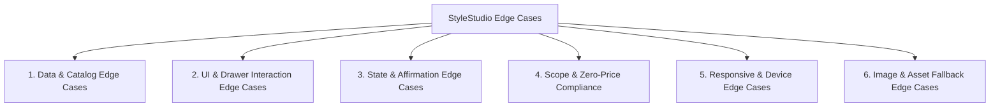

# Edge Cases & Corner Cases Specification — Myntra "StyleStudio" MVP

This document identifies all functional, UI/UX, state management, data, and compliance edge cases for the StyleStudio MVP, detailing the failure mode, trigger condition, and expected system mitigation.

---

## 📋 Edge Case Taxonomy Matrix

---

## 1. Data & Pairing Engine Edge Cases

### 1.1 Anchor Item Has Fewer Than 3 Pre-Defined Occasion Pairings
- **Trigger:** A wishlist item has only 1 or 2 pre-configured pairings in the seed dataset.
- **Failure Mode:** "Rule of 3" expectation is violated; layout might show an unbalanced grid.
- **Mitigation:**
  - The pairing engine checks `pairings.length < 3` and dynamically generates a fallback *“Versatile Smart Casual”* pairing using compatible neutrals from the catalog.
  - The drawer header dynamically reflects available looks (e.g., *"2 curated looks available"* instead of hardcoded *"3 ways"*).

### 1.2 Occasion Filter Yields Zero Results
- **Trigger:** User selects an occasion pill (e.g., `Evening Out`) for an anchor item that only has `Office` and `Weekend Casual` styles.
- **Failure Mode:** Blank/empty drawer body causing confusion.
- **Mitigation:**
  - Render an elegant empty state: *"No Evening Out looks yet for this piece. Try viewing All Looks."* with a one-tap button to reset filter to `All Looks`.
  - Filter pills dynamically show count badges (e.g., `Office (1)`, `Weekend (1)`), or disable tabs with 0 results.

### 1.3 Self-Pairing Collision
- **Trigger:** Recommendation algorithm selects the anchor item itself as a complementary piece (e.g., Mango Linen Blazer paired with Mango Linen Blazer).
- **Failure Mode:** Unrealistic outfit representation.
- **Mitigation:**
  - Strict filter rule: `complementaryItems.filter(item => item.id !== anchorItem.id && item.category !== anchorItem.category)`.

### 1.4 Category Incompatibility
- **Trigger:** Algorithm pairs two items of identical slot (e.g., 2 pairs of footwear or 2 outerwear items together).
- **Failure Mode:** Invalid outfit (e.g., Loafers + Sneakers together).
- **Mitigation:**
  - Slot constraint enforcement: an outfit pairing can contain maximum 1 item per category slot (`1 Topwear/Inner`, `1 Bottomwear`, `1 Footwear`, `1 Layer`).

---

## 2. UI & Drawer Interaction Edge Cases

### 2.1 Background Scroll-Bleed (Overscroll / Momentum Scrolling)
- **Trigger:** User scrolls to the bottom of the StyleStudio drawer and continues swiping down on mobile touch devices.
- **Failure Mode:** The background wishlist page underneath begins scrolling independently, causing disorienting layout shifts.
- **Mitigation:**
  - Implement body scroll lock when drawer is active: `document.body.style.overflow = 'hidden'` with iOS touchmove event prevention (`touch-action: none` on backdrop).

### 2.2 Rapid Sequential Clicking on Wishlist "✨ Style This" Buttons
- **Trigger:** User taps "✨ Style This" on Item A, then immediately taps Item B before animation completes.
- **Failure Mode:** Race condition resulting in wrong anchor item loaded or flickering drawer state.
- **Mitigation:**
  - State setter updates atomically; drawer re-renders cleanly for the newest item without crashing.
  - Debounce drawer open trigger by 150ms.

### 2.3 Super Long Text in Product Titles or Styling Rationales
- **Trigger:** Brand name is 25+ characters or styling rationale contains multi-clause fashion explanation.
- **Failure Mode:** Text overflows card boundary, wraps awkwardly, or breaks container alignment.
- **Mitigation:**
  - Product titles use `line-clamp-2` with `text-ellipsis`.
  - Styling rationale container uses flexible box with minimum padding and `text-xs leading-relaxed` typography.

### 2.4 Ultra-Compact Mobile Viewports (e.g., 320px width / iPhone SE / 568px height)
- **Trigger:** User loads the web app on small screen devices.
- **Failure Mode:** Drawer exceeds viewport height, pairing CTA gets pushed below fold without scrollability.
- **Mitigation:**
  - Drawer max-height capped at `max-h-[85vh]` with internal `overflow-y-auto` scrollable track.
  - Safe-area bottom padding (`pb-safe`) for iPhone home indicator.

### 2.5 Keyboard Navigation & Focus Trapping
- **Trigger:** User navigates using keyboard `Tab` or presses `Escape`.
- **Failure Mode:** Focus escapes behind modal backdrop to inaccessible background elements.
- **Mitigation:**
  - Add `keydown` listener for `Escape` key to instantly close drawer.
  - Close button receives autofocus on drawer mount.

---

## 3. State & Affirmation Edge Cases

### 3.1 Rapid Multi-Tapping on "Save this pairing"
- **Trigger:** User double-taps or repeatedly taps "Love this look" in rapid succession.
- **Failure Mode:** Multiple duplicate toast notifications stacked over each other, erratic state toggles.
- **Mitigation:**
  - Debounce the toggle function (300ms).
  - Toast notification manager dispatches a single toast with auto-dismiss after 2500ms; consecutive saves replace existing toast rather than stacking.

### 3.2 Removing Wishlisted Anchor Item While Drawer Is Open
- **Trigger:** User taps the 'X' (Remove from Wishlist) icon on the background card while drawer is open or immediately before.
- **Failure Mode:** Drawer tries to render deleted item reference, causing `null` pointer exceptions.
- **Mitigation:**
  - Defensive null-checks on `activeAnchorItem`.
  - If anchor item is removed, drawer automatically closes smoothly: `if (!activeAnchorItem) closeDrawer()`.

### 3.3 State Persistence on Page Refresh
- **Trigger:** User saves 2 pairings and refreshes the browser page.
- **Failure Mode:** Saved look confirmations are lost, reverting back to unselected state.
- **Mitigation:**
  - Sync `savedPairingIds` with browser `localStorage` (`myntra_stylestudio_saved_pairings`).
  - On mount, initialize state from `localStorage` with fallback to empty map `{}`.

---

## 4. Scope & Zero-Price Compliance Edge Cases

### 4.1 Accidental Injection of Monetary Data
- **Trigger:** Sample catalog JSON accidentally contains a `price` or `discount` key, or developer uses standard eCommerce card template.
- **Failure Mode:** Violation of the core MVP zero-price constraint.
- **Mitigation:**
  - TypeScript interface `CatalogItem` strictly omits `price`, `discount`, `mrp`, and `currency` fields.
  - Component code sanitization ensures no currency symbols (`₹`, `$`, `EUR`) are ever rendered.

### 4.2 Click-Through Traps on Complementary Items
- **Trigger:** User taps on a complementary shoe or trouser thumbnail inside an outfit pairing card expecting product details.
- **Failure Mode:** Triggers a broken navigation or non-existent PDP route.
- **Mitigation:**
  - Tapping a complementary thumbnail opens an in-card tooltip / preview label (*"Item: Pointed Leather Loafers by Mango"*) without full-page navigation.
  - No external links or purchase-forcing redirects are attached.

---

## 5. Image & Asset Fallback Edge Cases

### 5.1 Broken or Slow Image URL
- **Trigger:** Network disconnect or CDN failure on fashion product photo.
- **Failure Mode:** Broken image icon (`[?]`) disrupts visual appeal.
- **Mitigation:**
  - Implement an `ImageWithFallback` component with `onError` event handler:
  - If external image fails, seamlessly falls back to a clean SVG placeholder showing category icon (e.g. Blazer/Dress icon on neutral gray `#F5F5F6` background).

### 5.2 Aspect Ratio Mismatch
- **Trigger:** Mix of landscape and portrait images in catalog seed.
- **Failure Mode:** Irregular card heights causing staggered broken layouts.
- **Mitigation:**
  - Force uniform aspect ratio on all garment thumbnails: `aspect-[3/4] object-cover object-center w-full`.

---

## 6. Cold Start & Public Deployment Edge Cases

### 6.1 Serverless Cold Starts / Static Host Hydration
- **Trigger:** User opens the public Vercel/Netlify URL after hours of inactivity.
- **Failure Mode:** Hydration mismatch or slow initial render.
- **Mitigation:**
  - Build as a pure client-side single page app (Vite SPA) or static export (Next.js SSG) so 100% of assets and seed data are immediately available with zero API dependency or cold start latency.

---

## 7. Edge Case Testing & QA Checklist

| Test # | Test Scenario | Trigger Action | Expected Outcome | Pass/Fail |
|---|---|---|---|---|
| **TC-01** | Rapid Drawer Toggles | Tap "✨ Style This" and Close 'X' 5 times in 2 seconds | Smooth transitions, no layout freezing or memory leaks | [ ] |
| **TC-02** | Body Scroll Lock | Open drawer and swipe scroll background page | Background stays firmly locked; drawer content scrolls smoothly | [ ] |
| **TC-03** | Missing Occasion Filter | Select an occasion with no pairings | Shows friendly empty state with 1-click reset to All Looks | [ ] |
| **TC-04** | Rapid Save Toggling | Tap "Save this pairing" repeatedly 4 times | Toggles cleanly between Saved/Unsaved, single toast alert | [ ] |
| **TC-05** | Image Fallback Check | Simulate offline/broken image URL | Renders elegant category placeholder with zero layout break | [ ] |
| **TC-06** | Escape Key Dismissal | Press `ESC` key while drawer is active | Drawer closes immediately | [ ] |
| **TC-07** | Currency Grep Audit | Search build output for `₹`, `Rs`, `INR`, `$` | Exactly 0 matches found in all output files | [ ] |
| **TC-08** | Multi-Anchor Switch | Open Blazer $\rightarrow$ close $\rightarrow$ open Poplin Shirt | Drawer displays new shirt items and shirt-specific rationales | [ ] |
